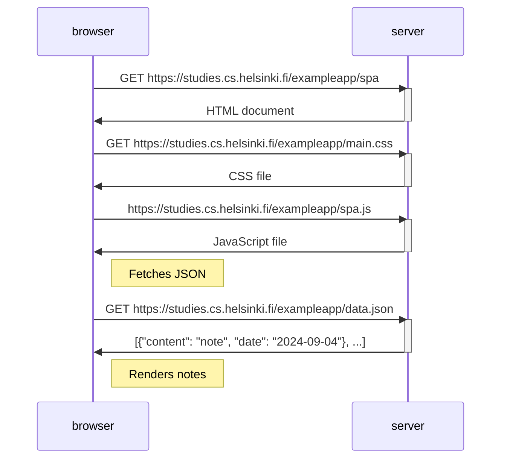

```mermaid
sequenceDiagram
    participant browser
    participant server

    browser->>server: GET https://studies.cs.helsinki.fi/exampleapp/spa
    activate server
    server->>browser: HTML document
    deactivate server

    browser->>server: GET https://studies.cs.helsinki.fi/exampleapp/main.css
    activate server
    server->>browser: CSS file
    deactivate server

    browser->>server: https://studies.cs.helsinki.fi/exampleapp/spa.js
    activate server
    server->>browser: JavaScript file
    deactivate server

    Note right of browser: Fetches JSON

    browser->>server: GET https://studies.cs.helsinki.fi/exampleapp/data.json
    activate server
    server->>browser: [{"content": "note", "date": "2024-09-04"}, ...]
    deactivate server

    Note right of browser: Renders notes
```